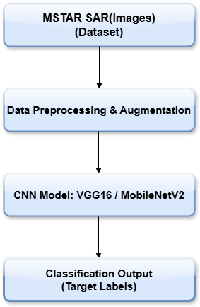

# Radar Target Classification using Transfer Learning:
# A Spiral Approach with VGG16 and MobileNetV2


##  Project Overview
This project implements a deep learning-based Synthetic Aperture Radar (SAR) Automatic Target Recognition (ATR) system using transfer learning. We applied pre-trained models (VGG16 and MobileNetV2) on the MSTAR dataset to classify SAR images into eight target categories. The system follows a spiral development model with iterative performance improvement via fine-tuning, data augmentation, and regularization.

##  Dataset
- **Name:** MSTAR SAR Dataset (8-class version)
- **Classes:** 2S1, BRDM-2, BTR-60, D7, SLICY, T62, ZIL131, ZSU-23/4
- **Image Size:** 128×128 or 256×256 grayscale SAR images
- **Split:** 80% training, 20% validation

##  Model Architectures
- **VGG16:** High-accuracy baseline model
- **MobileNetV2:** Lightweight model for deployment scenarios

##  Spiral Iterations
- **Iteration 1:** Baseline training using frozen pre-trained weights
- **Iteration 2:** Fine-tuning + stronger data augmentation + regularization

## 📈 Performance Highlights
| Model         | Validation Accuracy | Generalization Gap | Parameters      |
|---------------|---------------------|---------------------|------------------|
| VGG16         | ~99%                | ~1%                 | ~15M              |
| MobileNetV2   | ~95%                | ~1-2%               | ~3.5M             |

##  System Architecture


##  Sample Results  
- Accuracy and loss curves
- Confusion matrices
(See figures in `results/` directory)

##  Report
The full technical report (IEEE format) is available in this repository under `report.pdf`.

##  EU AI Regulation Note
This project may fall under "High-Risk AI Systems" as per the EU AI Act, especially in military or critical infrastructure use cases. Proper model documentation, fairness assessment, and explainability are essential if deployed in real-world settings.

##  How to Run
```bash
# Install dependencies
pip install -r requirements.txt

# Train the model
python train_vgg16.py
python train_mobilenetv2.py
